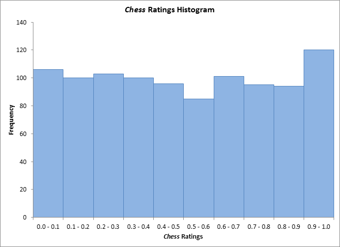
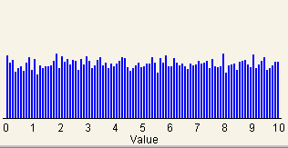

# Distribution Sort Pt. 1 – Bucket Sort

**Bucket sort**, also known as *bin sort*, is a non-comparative sorting algorithm. Bucket sort works by distributing the elements of an array into "buckets", or sublists, and then applying a comparative sorting algorithm (insertion sort) on each bucket. 

Bucket sort is an optimization of *counting sort*, working on the premise that breaking down the original, unsorted array into sublists is more efficient, taking less time to be sorted.

There are two important considerations for distribution sorting algorithms:

1. The *density* of the elements to be sorted– that is, the relative distribution of the elements to be sorted; and
1. The number of buckets to create. 

 

Distribution sorts are best used when the data to be sorted is relatively evenly distributed, so that each bucket has the same number of elements and no buckets are empty. To calculate the number of buckets when a solution isn't obvious, a general rule of thumb is to use the square root of the number of elements to be sorted.

## Bucket Sort In Action

In action, bucket sort proceeds by:

1. Starting with the original array. 
1. Creating an array of initially empty “buckets,” depending on the number of elements in the original array.
1. **Scatter** each element from the original array into it's appropriate bucket.
1. Sort each bucket.
1. **Gather** the elements by sequentially pushing the contents of the buckets back into the original single array.

## Big O Complexity

### Worst Case Complexity: `O(n^2)`

If the set of elements to be sorted are too dense, they may all be placed into a single bucket, making buckets unevenly distributed; similarly, if the elements are too spread out, you may create empty buckets.

The complexity becomes even worse when the elements are in reverse order. If insertion sort is used to sort elements of the bucket, then the time complexity becomes `O(n^2)`.

### Best Case Complexity: `O(n+k)`

It the set of elements are uniformly distributed in the buckets with a nearly equal number of elements in each bucket, we can achieve the best case time complexity of `O(n+k)`, where `O(n)` is the complexity for creating the buckets, and `O(k)` is the complexity for sorting the elements of the bucket (using an algorithm that has linear time complexity at best case).

> The term **uniform distribution** is used to describe the shape of a graph that plots observed values in a set of data. Graphically, when the observed values in a set of data are equally spread across the range of the data set, the distribution is also called a uniform distribution. Graphically, a uniform distribution has no distinct peaks.

## Bucket Sort Exercise

In this repo, you'll find 2 possible solutions for an implementation of bucket sort. Choose one of the solutions, and in pairs, have one group member share their screen; use line-by-line comments and console.logs to your benefit to understand the moving pieces of a bucket sort.
